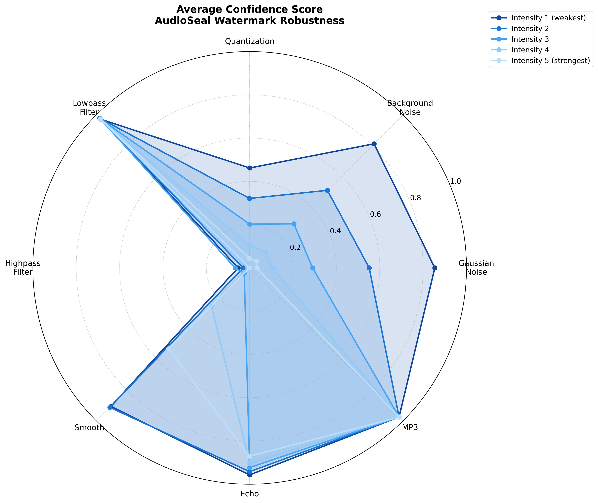
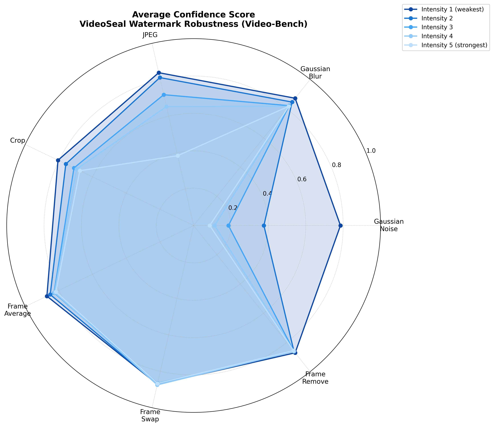

# AIGC标识技术开发套件

<div align="center">
  <!-- 项目logo占位符 - 需要logo图片 -->
  <!-- <a href="https://github.com/your-repo-link">
    
  </a> -->


  <h3 align="center">AIGC标识技术开发套件</h3>

  <p align="center">
    一站式开源标识技术开发套件，支持文本、图像、音频和视频内容的显式标识，隐式标识和隐水印功能
    <br />
    <a href="#使用方法"><strong>快速开始 »</strong></a>
    <br />
  </p>

</div>

<div align="center">
  <a href="./README_EN.md">English</a> | 简体中文
</div>

---

## 关于项目

<!-- 项目截图占位符 - 需要网页界面截图 -->
<!-- [![产品截图][product-screenshot]](https://example.com) -->

本项目提供一站式开源标识技术开发套件。支持文本、图像、音频和视频四大模态，具备显式标识和隐水印功能，覆盖GB 45438-2025《网络安全技术 人工智能生成合成内容标识方法》标准规定的标识范围。

### 为什么选择我们？

- **全面覆盖**：支持GB 45438-2025标准要求的标识方法
- **多模态支持**：统一处理文本、图像、音频和视频内容
- **双模式操作**：既支持AI内容生成，也支持现有文件处理

### 构建技术

* [![Python][Python.org]][Python-url]
[![PyTorch][PyTorch.org]][PyTorch-url]
[![Flask][Flask.palletsprojects.com]][Flask-url] [![Transformers][Transformers-badge]][Transformers-url] [![Diffusers][Diffusers-badge]][Diffusers-url]

<p align="right">(<a href="#readme-top">返回顶部</a>)</p>

## 开始使用

### 安装

#### 🔧 传统安装

1. 克隆仓库

   ```bash
   git clone --recurse-submodules https://github.com/MillionMillionLi/AIGC-Identification-Toolkit.git
   cd AIGC-Identification-Toolkit
   ```

2. 安装核心依赖

   ```bash
   pip install -r requirements.txt
   ```

3. 安装系统依赖

   ```bash
   sudo apt install ffmpeg
   ```

4. （可选）下载 AI 生成模型

   仅当需要使用 AI 生成内容并添加水印功能时才需要此步骤。如果只处理已有文件（上传模式添加水印），可跳过此步骤。

   ```bash
   # 图像生成 + 水印（Stable Diffusion 2.1）
   python scripts/download_sd_model.py

   # 视频生成 + 水印（Wan2.1）
   python scripts/download_wan_model.py

   # 文本生成 + 水印（PostMark + Mistral）
   python scripts/download_postmark_deps.py

   # 音频生成 + 水印（Bark）
   python scripts/download_bark_model.py
   pip install git+https://github.com/suno-ai/bark.git
   ```

5. 配置环境

   ```bash
   export TRANSFORMERS_OFFLINE=1
   export HF_HUB_OFFLINE=1
   export HF_ENDPOINT=https://hf-mirror.com
   ```
#### 🐳 Docker 安装（推荐）

Docker 方式为推荐的安装方式，提供开箱即用的环境，无需手动配置依赖。

##### 前置要求

1. **NVIDIA GPU 和驱动**
   ```bash
   # 检查 GPU 和 CUDA 版本
   nvidia-smi
   # 需要 CUDA 11.8 或更高版本
   ```

2. **NVIDIA Container Toolkit**
   ```bash
   # Ubuntu/Debian 安装
   distribution=$(. /etc/os-release;echo $ID$VERSION_ID)
   curl -fsSL https://nvidia.github.io/libnvidia-container/gpgkey | sudo gpg --dearmor -o /usr/share/keyrings/nvidia-container-toolkit-keyring.gpg
   curl -s -L https://nvidia.github.io/libnvidia-container/$distribution/libnvidia-container.list | \
     sed 's#deb https://#deb [signed-by=/usr/share/keyrings/nvidia-container-toolkit-keyring.gpg] https://#g' | \
     sudo tee /etc/apt/sources.list.d/nvidia-container-toolkit.list
   sudo apt-get update && sudo apt-get install -y nvidia-container-toolkit
   sudo systemctl restart docker

   # 验证安装
   docker run --rm --gpus all nvidia/cuda:11.8.0-base-ubuntu22.04 nvidia-smi
   ```

3. **Docker 和 Docker Compose**
   - Docker Engine >= 20.10
   - Docker Compose >= 2.0

##### 快速开始

1. **克隆仓库**
   ```bash
   git clone --depth 1 https://github.com/MillionMillionLi/AIGC-Identification-Toolkit.git
   cd AIGC-Identification-Toolkit
   ```

2. **启动容器**（自动拉取预构建镜像）
   ```bash
   docker compose up -d
   ```

   首次启动会自动从 DockerHub 拉取镜像（约 8GB），需要 5-10 分钟。

3. **进入容器**
   ```bash
   docker exec -it aigc-watermark-toolkit bash
   ```

4. **运行测试验证**
   ```bash
   # 容器内执行
   python tests/test_unified_engine.py
   ```

##### 模型准备说明

**首次运行时，容器会自动下载 AI 模型到主机的 `~/.cache/huggingface` 目录（约 35GB），需要一定时间。**

如果你已经下载了模型，确保模型位于 `~/.cache/huggingface/`。如果模型在其他路径，修改 `docker-compose.yml`：

```yaml
volumes:
  - /你的模型路径/.cache/huggingface:/cache/huggingface
```

**所需模型列表**：
- 图像生成：Stable Diffusion 2.1 (`stabilityai/stable-diffusion-2-1-base`)
- 视频生成：Wan2.1 (`Wan-AI/Wan2.1-T2V-1.3B-Diffusers`)
- 文本生成：Mistral 7B (`mistralai/Mistral-7B-Instruct-v0.2`)
- 音频生成：Bark (`suno/bark`)


## 使用方法


`WatermarkTool`是推荐的主要入口点，提供统一的接口支持所有模态的水印和显式标识操作。

#### 初始化

```python
from src.unified.watermark_tool import WatermarkTool

# 使用默认配置初始化
tool = WatermarkTool()

# 使用自定义配置初始化
tool = WatermarkTool(config_path="path/to/config.yaml")
```

#### 核心方法

##### embed() - 嵌入水印或显式标识

```python
def embed(self,
          content: Union[str, Path],
          message: str,
          modality: str,
          operation: str = 'watermark',
          **kwargs) -> Union[str, PIL.Image, torch.Tensor, Path]:
    """
    嵌入水印或添加显式标识

    Args:
        content: 输入内容
            - 文本模态: 提示文本(AI生成)或文本文件路径(上传模式)
            - 图像模态: 提示文本(AI生成)或图像文件路径(上传模式)
            - 音频模态: 提示文本(AI生成)或音频文件路径(上传模式)
            - 视频模态: 提示文本(AI生成)或视频文件路径(上传模式)
        message: 要嵌入的水印信息或显式标识文本
        modality: 模态类型 ('text', 'image', 'audio', 'video')
        operation: 操作类型 ('watermark' 或 'visible_mark')
        **kwargs: 模态特定参数

    Returns:
        处理后的内容（格式根据模态而定）
    """
```

**使用示例：**

```python
# 隐式水印（默认operation='watermark'）
img_wm = tool.embed("a cat under the sun", "img_msg", 'image')


# 上传文件模式
img_wm = tool.embed("", "file_msg", 'image', image_input="/path/to/image.jpg")


# 显式标识
marked_img = tool.embed("/path/to/image.jpg", "AI标识", 'image',
                       operation='visible_mark', position='bottom_right')
```

##### extract() - 提取水印或检测显式标识

```python
def extract(self,
           content: Union[str, PIL.Image, torch.Tensor, Path],
           modality: str,
           operation: str = 'watermark',
           **kwargs) -> Dict[str, Any]:
    """
    提取水印或检测显式标识

    Args:
        content: 待检测的内容
        modality: 模态类型
        operation: 操作类型 ('watermark' 或 'visible_mark')
        **kwargs: 检测参数

    Returns:
        检测结果字典:
        {
            'detected': bool,      # 是否检测到水印/标识
            'message': str,        # 提取的消息内容
            'confidence': float,   # 置信度 (0.0-1.0)
            'metadata': dict       # 额外的元数据信息
        }
    """
```

**使用示例：**

```python
# 提取隐式水印
img_result = tool.extract(watermarked_image, 'image')


# 检测显式标识
mark_result = tool.extract(marked_content, 'text', operation='visible_mark')
```

##  Benchmarks

评估各模态水印算法的性能表现，提供标准化的测试数据集、攻击方式和评估指标，帮助用户选择最适合应用场景的算法。


---

### Image-Bench

评估图像水印算法对传统失真攻击（亮度、对比度、模糊、噪声、JPEG压缩）的鲁棒性。

**核心特性**:
-  **数据集**: W-Bench DISTORTION_1K（1000张图像）

-  **评估指标**: PSNR, SSIM, LPIPS, TPR，Bit accuracy, 置信度

**快速使用**:
```bash
python benchmarks/Image-Bench/run_benchmark.py
```
**结果分析**：
|  |  |  |
| --- | --- | --- |
|  |  |  |

**详细文档**: [benchmarks/Image-Bench/README.md](benchmarks/Image-Bench/README.md)

---

### Audio-Bench

评估音频水印算法（AudioSeal）对多种音频攻击的鲁棒性，覆盖噪声、滤波、压缩等常见干扰。

**核心特性**:
- 📊 **数据集**: [AudioMark Dataset](https://drive.google.com/drive/folders/1037mBf4LoGq0CDxe6hYx5fNNv56AY_9e)
- 🎯 **评估指标**: SNR, TPR (prob), TPR (BA), Bit Accuracy, 置信度
- 🔧 **攻击类型**: 高斯噪声、背景噪声、量化、滤波、平滑、回声、MP3压缩

**快速使用**:
```bash
python benchmarks/Audio-Bench/run_benchmark.py
```

**结果分析**：
| TPR (Detection Probability) | Avg Confidence | Bit Accuracy |
| --- | --- | --- |
|  |  |  |

**详细文档**: [benchmarks/Audio-Bench/README.md](benchmarks/Audio-Bench/README.md)

---

### Video-Bench

评估视频水印算法（VideoSeal）在图像级和视频级扰动下的鲁棒性，严格遵循VideoMarkBench论文方法。

**核心特性**:
- 📊 **数据集**: [VideoMarkBench Dataset](https://www.kaggle.com/datasets/zhengyuanjiang/videomarkbench/data)
- 🎯 **评估指标**: PSNR, SSIM, tLP, FNR, Bit Accuracy, 置信度
- 🔧 **攻击类型**: 高斯噪声、模糊、JPEG压缩、裁剪、帧平均、帧交换、帧删除

**快速使用**:
```bash
python benchmarks/Video-Bench/run_benchmark.py
```

**结果分析**：
| FNR | Bit Accuracy | Avg Confidence |
| --- | --- | --- |
|  |  |  |

**详细文档**: [benchmarks/Video-Bench/README.md](benchmarks/Video-Bench/README.md)

---

### Text-Bench（规划中）


<p align="right">(<a href="#readme-top">返回顶部</a>)</p>


## 致谢

本项目基于以下优秀的开源工作构建：

### 水印算法

* [Meta AudioSeal](https://github.com/facebookresearch/audioseal) - 音频水印算法
* [VideoSeal](https://github.com/facebookresearch/videoseal) - 视频/图像水印技术
* [PostMark](https://github.com/your-postmark-repo) - 文本后处理水印算法
* [CredID](https://github.com/your-credid-repo) - 多方文本水印框架
* [PRC-Watermark](https://github.com/rmin2000/PRC-Watermark) - 图像水印算法

### AI 生成模型

* [Stable Diffusion](https://github.com/Stability-AI/stablediffusion) - 文本生成图像模型
* [Wan2.1](https://huggingface.co/Wan-AI/Wan2.1-T2V-1.3B-Diffusers) - 文本生成视频模型
* [Bark](https://github.com/suno-ai/bark) - 文本转语音合成模型

### 评估与基准测试

* [VINE](https://github.com/Shilin-LU/VINE) - W-Bench 数据集和图像失真攻击实现
* [AudioMarkBench](https://github.com/mileskuo42/AudioMarkBench) - 音频水印评估框架


<p align="right">(<a href="#readme-top">返回顶部</a>)</p>

<!-- MARKDOWN链接和图像 -->

[Python.org]: https://img.shields.io/badge/Python-3776AB?style=for-the-badge&logo=python&logoColor=white
[Python-url]: https://python.org/
[PyTorch.org]: https://img.shields.io/badge/PyTorch-EE4C2C?style=for-the-badge&logo=pytorch&logoColor=white
[PyTorch-url]: https://pytorch.org/
[Flask.palletsprojects.com]: https://img.shields.io/badge/Flask-000000?style=for-the-badge&logo=flask&logoColor=white
[Flask-url]: https://flask.palletsprojects.com/
[Transformers-badge]: https://img.shields.io/badge/🤗%20Transformers-FFD700?style=for-the-badge
[Transformers-url]: https://huggingface.co/transformers/
[Diffusers-badge]: https://img.shields.io/badge/🧨%20Diffusers-FF6B6B?style=for-the-badge
[Diffusers-url]: https://huggingface.co/docs/diffusers/