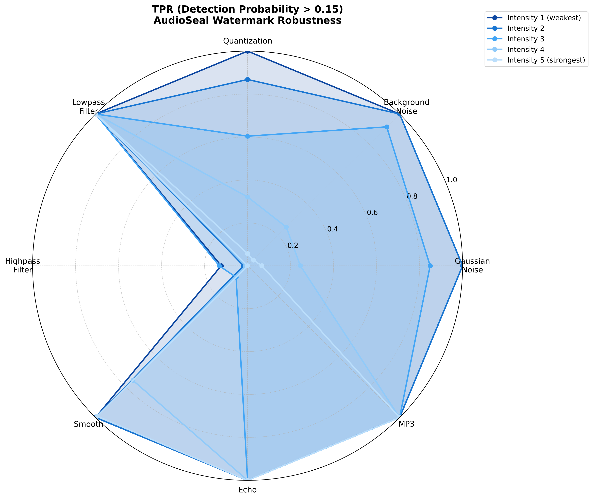
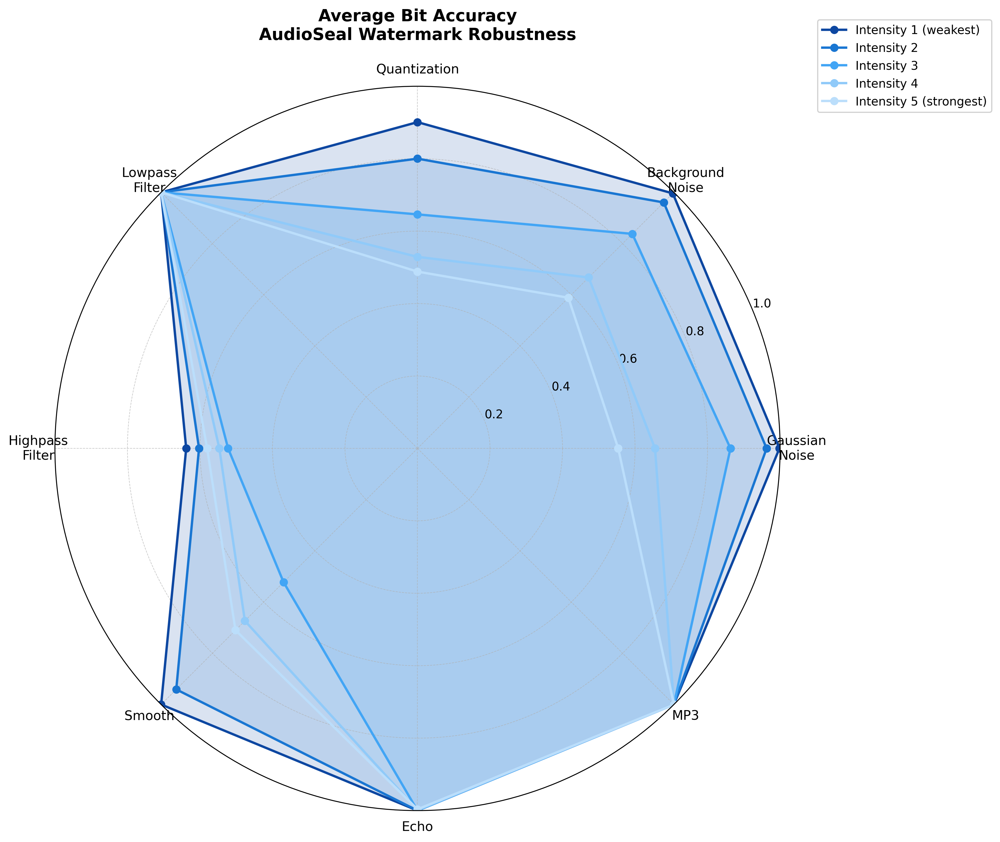
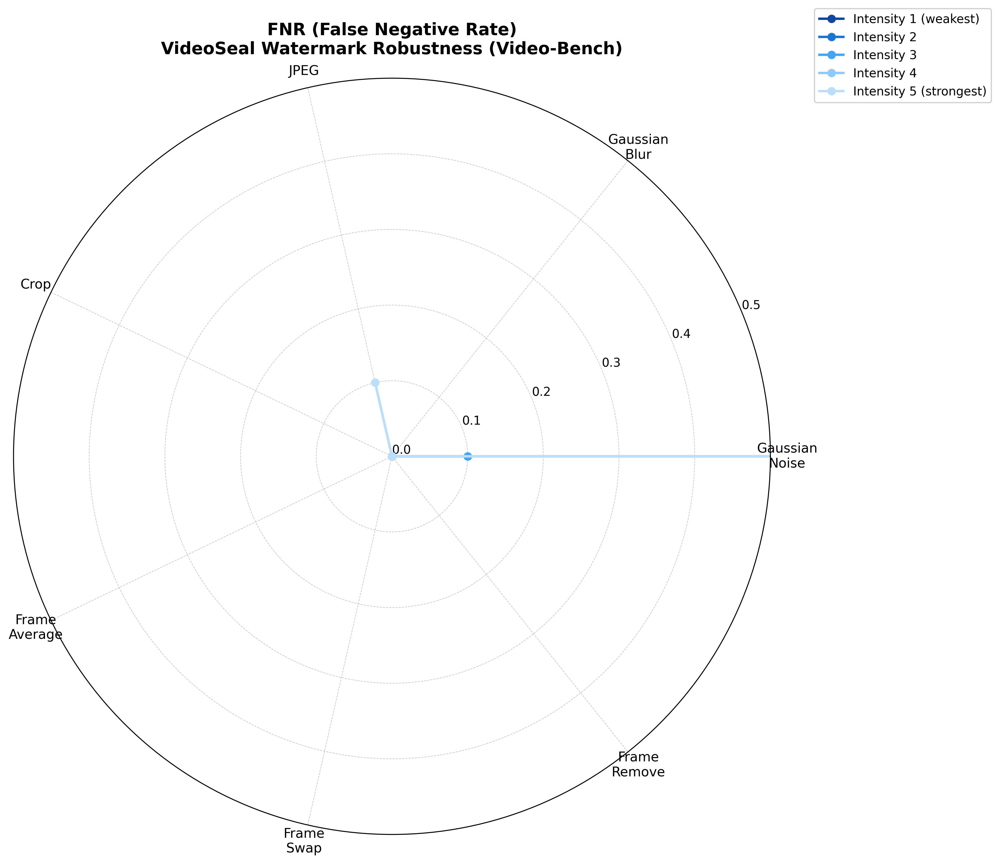
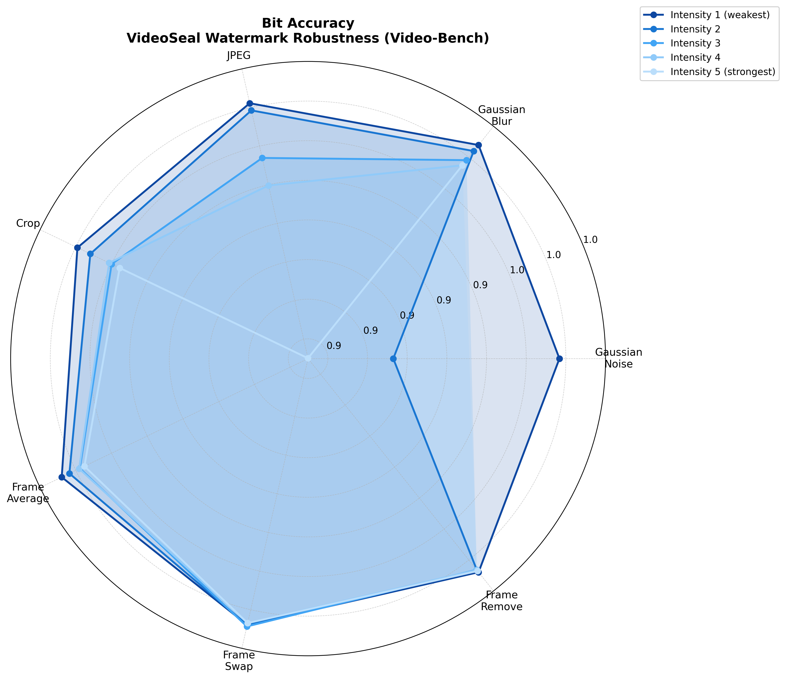

# AIGC Identification Toolkit

<div align="center">
  <!-- Project logo placeholder - logo image needed -->
  <!-- <a href="https://github.com/your-repo-link">
    
  </a> -->


  <h3 align="center">AIGC Identification Toolkit</h3>

  <p align="center">
    An all-in-one open-source identification toolkit supporting explicit marking, implicit marking, and watermarking for text, image, audio, and video content
    <br />
    <a href="#usage"><strong>Quick Start »</strong></a>
    <br />
  </p>

</div>

<div align="center">
  English | <a href="./README.md">简体中文</a>
</div>

---

## About The Project

<!-- Project screenshot placeholder - web interface screenshot needed -->
<!-- [![Product Screenshot][product-screenshot]](https://example.com) -->

This project provides an all-in-one open-source identification toolkit. Supporting four major modalities (text, image, audio, and video), it features explicit marking and watermarking capabilities, covering the identification scope specified in the GB 45438-2025 standard "Information Security Technology - Artificial Intelligence Generated and Synthesized Content Identification Methods".

### Why Choose Us?

- **Comprehensive Coverage**: Supports all identification methods required by GB 45438-2025 standard
- **Multi-modal Support**: Unified processing of text, image, audio, and video content
- **Dual-mode Operation**: Supports both AI content generation and existing file processing

### Built With

* [![Python][Python.org]][Python-url]
[![PyTorch][PyTorch.org]][PyTorch-url]
[![Flask][Flask.palletsprojects.com]][Flask-url] [![Transformers][Transformers-badge]][Transformers-url] [![Diffusers][Diffusers-badge]][Diffusers-url]

<p align="right">(<a href="#readme-top">back to top</a>)</p>

## Getting Started

### Installation

#### 🔧 Traditional Installation

1. Clone the repository

   ```bash
   git clone --recurse-submodules https://github.com/MillionMillionLi/AIGC-Identification-Toolkit.git
   cd AIGC-Identification-Toolkit
   ```

2. Install core dependencies

   ```bash
   pip install -r requirements.txt
   ```

3. Install system dependencies

   ```bash
   sudo apt install ffmpeg
   ```

4. (Optional) Download AI generation models

   This step is only required if you need to use AI-generated content with watermarking. If you only process existing files (upload mode watermarking), you can skip this step.

   ```bash
   # Image generation + watermark (Stable Diffusion 2.1)
   python scripts/download_sd_model.py

   # Video generation + watermark (Wan2.1)
   python scripts/download_wan_model.py

   # Text generation + watermark (PostMark + Mistral)
   python scripts/download_postmark_deps.py

   # Audio generation + watermark (Bark)
   python scripts/download_bark_model.py
   pip install git+https://github.com/suno-ai/bark.git
   ```

5. Configure environment

   ```bash
   export TRANSFORMERS_OFFLINE=1
   export HF_HUB_OFFLINE=1
   export HF_ENDPOINT=https://hf-mirror.com
   ```
#### 🐳 Docker Installation (Recommended)

**Prerequisites**: Requires NVIDIA GPU and [NVIDIA Container Toolkit](https://docs.nvidia.com/datacenter/cloud-native/container-toolkit/install-guide.html)

1. Start the container
   ```bash
   docker compose up -d
   ```
   First launch will automatically pull the pre-built image from [DockerHub](https://hub.docker.com/r/millionmillionli/aigc-identification-toolkit) (~8GB)

2. (Optional) Prepare AI generation models

   This step is only required if you need to use AI-generated content with watermarking.

   **Required models**:
   - Image generation: Stable Diffusion 2.1 (`stabilityai/stable-diffusion-2-1-base`)
   - Video generation: Wan2.1 (`Wan-AI/Wan2.1-T2V-1.3B-Diffusers`)
   - Text generation: Mistral 7B + PostMark embeddings (`mistralai/Mistral-7B-Instruct-v0.2`)
   - Audio generation: Bark (`suno/bark`)

   **Model storage location**:

   Docker will automatically search for the host's `~/.cache/huggingface/` directory. If your models are in a different path, modify `docker-compose.yml`:

   ```yaml
   volumes:
     # Change the first path to your actual model cache path
     - /your/path/.cache/huggingface:/cache/huggingface
   ```

3. Enter the container
   ```bash
   docker exec -it aigc-watermark-toolkit bash
   ```


## Usage


`WatermarkTool` is the recommended main entry point, providing a unified interface supporting watermarking and explicit marking operations for all modalities.

#### Initialization

```python
from src.unified.watermark_tool import WatermarkTool

# Initialize with default configuration
tool = WatermarkTool()

# Initialize with custom configuration
tool = WatermarkTool(config_path="path/to/config.yaml")
```

#### Core Methods

##### embed() - Embed Watermark or Explicit Mark

```python
def embed(self,
          content: Union[str, Path],
          message: str,
          modality: str,
          operation: str = 'watermark',
          **kwargs) -> Union[str, PIL.Image, torch.Tensor, Path]:
    """
    Embed watermark or add explicit mark

    Args:
        content: Input content
            - Text modality: Prompt text (AI generation) or text file path (upload mode)
            - Image modality: Prompt text (AI generation) or image file path (upload mode)
            - Audio modality: Prompt text (AI generation) or audio file path (upload mode)
            - Video modality: Prompt text (AI generation) or video file path (upload mode)
        message: Watermark information or explicit mark text to embed
        modality: Modality type ('text', 'image', 'audio', 'video')
        operation: Operation type ('watermark' or 'visible_mark')
        **kwargs: Modality-specific parameters

    Returns:
        Processed content (format varies by modality)
    """
```

**Usage examples:**

```python
# Implicit watermark (default operation='watermark')
img_wm = tool.embed("a cat under the sun", "img_msg", 'image')


# Upload file mode
img_wm = tool.embed("", "file_msg", 'image', image_input="/path/to/image.jpg")


# Explicit mark
marked_img = tool.embed("/path/to/image.jpg", "AI Mark", 'image',
                       operation='visible_mark', position='bottom_right')
```

##### extract() - Extract Watermark or Detect Explicit Mark

```python
def extract(self,
           content: Union[str, PIL.Image, torch.Tensor, Path],
           modality: str,
           operation: str = 'watermark',
           **kwargs) -> Dict[str, Any]:
    """
    Extract watermark or detect explicit mark

    Args:
        content: Content to detect
        modality: Modality type
        operation: Operation type ('watermark' or 'visible_mark')
        **kwargs: Detection parameters

    Returns:
        Detection result dictionary:
        {
            'detected': bool,      # Whether watermark/mark is detected
            'message': str,        # Extracted message content
            'confidence': float,   # Confidence score (0.0-1.0)
            'metadata': dict       # Additional metadata
        }
    """
```

**Usage examples:**

```python
# Extract implicit watermark
img_result = tool.extract(watermarked_image, 'image')


# Detect explicit mark
mark_result = tool.extract(marked_content, 'text', operation='visible_mark')
```

##  Benchmarks

Evaluate the performance of watermarking algorithms across different modalities, providing standardized test datasets, attack methods, and evaluation metrics to help users choose the most suitable algorithm for their application scenarios.


---

### Image-Bench

Evaluate image watermarking algorithm robustness against traditional distortion attacks (brightness, contrast, blur, noise, JPEG compression).

**Core Features**:
-  **Dataset**: W-Bench DISTORTION_1K (1000 images)

-  **Evaluation Metrics**:: PSNR, SSIM, LPIPS, TPR, Bit accuracy

**Quick Start**:
```bash
python benchmarks/Image-Bench/run_benchmark.py
```

**Using Custom Dataset**:
1. Prepare image data: Place PNG images in a custom directory (e.g., `benchmarks/Image-Bench/dataset/my_dataset/`)
2. Modify configuration `configs/videoseal_distortion.yaml`:
   ```yaml
   dataset:
     path: benchmarks/Image-Bench/dataset/my_dataset
   ```
**Evaluation Metrics**:
| Metric Category | Metric | Threshold | Description |
|----------|------|----------|----------|
| **Quality** | PSNR | ≥ 35.0 dB | Peak Signal-to-Noise Ratio, higher is better |
| **Quality** | SSIM | ≥ 0.95 | Structural Similarity Index, closer to 1 is better |
| **Quality** | LPIPS | ≤ 0.015 | Learned Perceptual Similarity, lower is better |
| **Robustness** | TPR | ≥ 0.80 | True Positive Rate (detection success rate), higher indicates stronger robustness |
| **Robustness** | Bit Accuracy | ≥ 0.85 | Watermark bit accuracy, determines closeness of decoded result to original watermark |

**Result Analysis**:
<table>
  <tr>
    <th>TPR</th>
    <th>Bit Accuracy</th>
    <th>Quality Metrics</th>
  </tr>
  <tr>
    <td></td>
    <td></td>
    <td style="vertical-align: top; height: 100%;">
      <table>
        <tr><th>Metric</th><th>Value</th><th style="white-space: nowrap;">Meets Threshold</th></tr>
        <tr><td><strong>PSNR</strong></td><td>45.52 dB</td><td>✅</td></tr>
        <tr><td><strong>SSIM</strong></td><td>0.9953</td><td>✅</td></tr>
        <tr><td><strong>LPIPS</strong></td><td>0.0025</td><td>✅</td></tr>
      </table>
    </td>
  </tr>
</table>

**Detailed Documentation**: [benchmarks/Image-Bench/README.md](benchmarks/Image-Bench/README.md)

---

### Audio-Bench

Evaluate the robustness of audio watermarking algorithms (AudioSeal) against various audio attacks, covering common interferences such as noise, filtering, and compression.

**Core Features**:
- 📊 **Dataset**: [AudioMark Dataset](https://drive.google.com/drive/folders/1037mBf4LoGq0CDxe6hYx5fNNv56AY_9e)
- 🔧 **Attack Types**: Gaussian noise, background noise, quantization, filtering, smoothing, echo, MP3 compression

**Quick Start**:
```bash
python benchmarks/Audio-Bench/run_benchmark.py
```

**Using Custom Dataset**:
1. Prepare audio data: Place audio files (supports WAV/MP3/FLAC/M4A) in a custom directory
2. Modify configuration `configs/audioseal_robustness.yaml`:
   ```yaml
   dataset:
     path: benchmarks/Audio-Bench/dataset/my_audio_dataset
   ```
**Evaluation Metrics**:
| Metric Category | Metric | Threshold | Description |
|----------|------|----------|----------|
| **Quality** | SNR | ≥ 20.0 dB | Signal-to-Noise Ratio, original audio vs watermarked audio, higher is better |
| **Robustness** | TPR (Detection Probability) | ≥ 0.80 | True Positive Rate determined by detection probability |
| **Robustness** | Bit Accuracy | ≥ 0.875 | Pattern watermark bit accuracy, higher is better |

**Result Analysis**:
<table>
  <tr>
    <th>TPR (Detection Probability)</th>
    <th>Bit Accuracy</th>
    <th>Quality Metrics</th>
  </tr>
  <tr>
    <td></td>
    <td></td>
    <td style="vertical-align: top; height: 100%;">
      <table>
        <tr><th>Metric</th><th>Value</th><th style="white-space: nowrap;">Meets Threshold</th></tr>
        <tr><td><strong>SNR</strong></td><td>23</td><td>✅</td></tr>
      </table>
    </td>
  </tr>
</table>


**Detailed Documentation**: [benchmarks/Audio-Bench/README.md](benchmarks/Audio-Bench/README.md)

---

### Video-Bench

Evaluate the robustness of video watermarking algorithms (VideoSeal) under image-level and video-level perturbations, strictly following the VideoMarkBench paper methodology.

**Core Features**:
- 📊 **Dataset**: [VideoMarkBench Dataset](https://www.kaggle.com/datasets/zhengyuanjiang/videomarkbench/data)
- 🔧 **Attack Types**: Gaussian noise, blur, JPEG compression, cropping, frame averaging, frame swapping, frame deletion

**Quick Start**:
```bash
python benchmarks/Video-Bench/run_benchmark.py
```

**Using Custom Dataset**:
1. Prepare video data: Place video files (supports MP4/AVI/MOV/MKV) in a custom directory, supports subdirectories
2. Modify configuration `configs/videoseal_robustness.yaml`:
   ```yaml
   dataset:
     path: benchmarks/Video-Bench/dataset/my_video_dataset
   ```

**Evaluation Metrics**:

| Metric Category | Metric | Threshold | Description |
|----------|------|----------|----------|
| **Quality** | PSNR | ≥ 35.0 dB | Peak Signal-to-Noise Ratio, higher is better |
| **Quality** | SSIM | ≥ 0.95 | Structural Similarity Index, closer to 1 is better |
| **Quality** | tLP | ≤ 0.20 | Temporal LPIPS, measures cross-frame perceptual consistency, lower is better |
| **Robustness** | FNR | ≤ 0.01 | False Negative Rate (miss detection rate), lower indicates stronger robustness |
| **Robustness** | Bit Accuracy | ≥ 0.85 | Decoded bit accuracy, higher is better |

**Result Analysis**:
<table>
  <tr>
    <th>FNR</th>
    <th>Bit Accuracy</th>
    <th>Quality Metrics</th>
  </tr>
  <tr>
    <td></td>
    <td></td>
    <td style="vertical-align: top; height: 100%;">
      <table>
        <tr><th>Metric</th><th>Value</th><th style="white-space: nowrap;">Meets Threshold</th></tr>
        <tr><td><strong>PSNR</strong></td><td>40.59</td><td>✅</td></tr>
        <tr><td><strong>SSIM</strong></td><td>0.97</td><td>✅</td></tr>
        <tr><td><strong>tLP</strong></td><td>0.001</td><td>✅</td></tr>
      </table>
    </td>
  </tr>
</table>

**Detailed Documentation**: [benchmarks/Video-Bench/README.md](benchmarks/Video-Bench/README.md)

---

### Text-Bench (Planned)


<p align="right">(<a href="#readme-top">back to top</a>)</p>


## Acknowledgments

This project is built upon the following excellent open-source works:

### Watermarking Algorithms

* [Meta AudioSeal](https://github.com/facebookresearch/audioseal) - Audio watermarking algorithm
* [VideoSeal](https://github.com/facebookresearch/videoseal) - Video/image watermarking technology
* [PostMark](https://github.com/your-postmark-repo) - Text post-processing watermarking algorithm
* [CredID](https://github.com/your-credid-repo) - Multi-party text watermarking framework
* [PRC-Watermark](https://github.com/rmin2000/PRC-Watermark) - Image watermarking algorithm

### AI Generation Models

* [Stable Diffusion](https://github.com/Stability-AI/stablediffusion) - Text-to-image generation model
* [Wan2.1](https://huggingface.co/Wan-AI/Wan2.1-T2V-1.3B-Diffusers) - Text-to-video generation model
* [Bark](https://github.com/suno-ai/bark) - Text-to-speech synthesis model

### Evaluation and Benchmarking

* [VINE](https://github.com/Shilin-LU/VINE) - W-Bench dataset and image distortion attack implementations
* [AudioMarkBench](https://github.com/mileskuo42/AudioMarkBench) - Audio watermark evaluation framework


<p align="right">(<a href="#readme-top">back to top</a>)</p>

<!-- MARKDOWN links and images -->

[Python.org]: https://img.shields.io/badge/Python-3776AB?style=for-the-badge&logo=python&logoColor=white
[Python-url]: https://python.org/
[PyTorch.org]: https://img.shields.io/badge/PyTorch-EE4C2C?style=for-the-badge&logo=pytorch&logoColor=white
[PyTorch-url]: https://pytorch.org/
[Flask.palletsprojects.com]: https://img.shields.io/badge/Flask-000000?style=for-the-badge&logo=flask&logoColor=white
[Flask-url]: https://flask.palletsprojects.com/
[Transformers-badge]: https://img.shields.io/badge/🤗%20Transformers-FFD700?style=for-the-badge
[Transformers-url]: https://huggingface.co/transformers/
[Diffusers-badge]: https://img.shields.io/badge/🧨%20Diffusers-FF6B6B?style=for-the-badge
[Diffusers-url]: https://huggingface.co/docs/diffusers/
