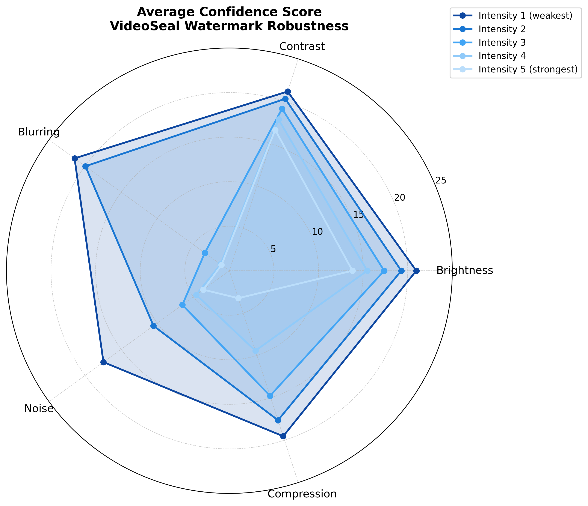
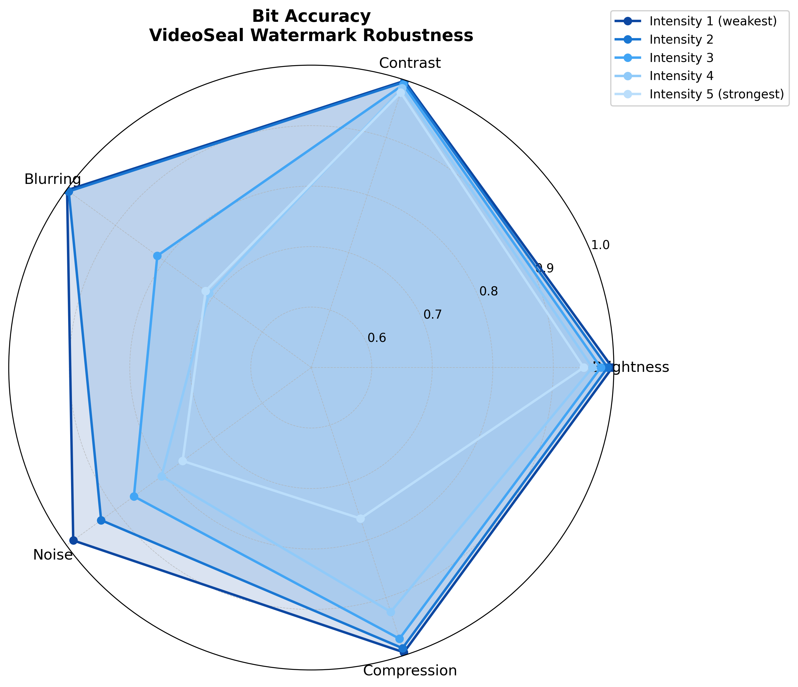
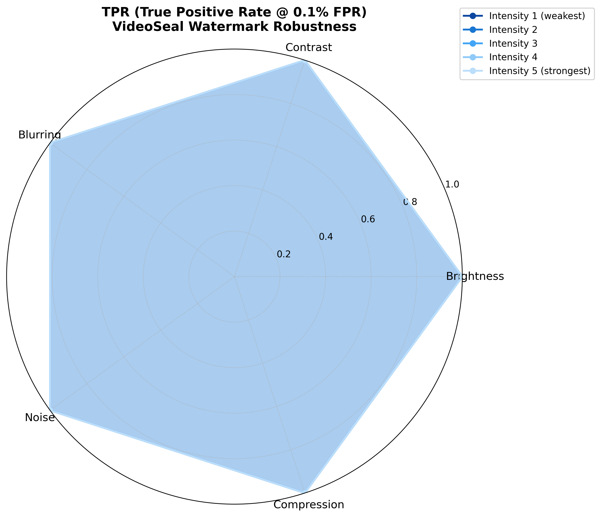

# Image-Bench: Image Watermark Robustness Evaluation Benchmark

[](https://www.python.org/downloads/)
[](https://opensource.org/licenses/MIT)
[](https://huggingface.co/datasets/Shilin-LU/W-Bench)

> Evaluate the robustness of image watermarking algorithms under traditional distortion attacks, based on the W-Bench DISTORTION_1K dataset (1000 images × 25 attack configurations).


---

## 🚀 Quick Start

### 1. Install Dependencies

```bash
# Required dependencies
pip install pillow numpy torch tqdm pyyaml

# Quality metrics calculation
pip install scikit-image lpips
```

### 2. Download Dataset


```bash
huggingface-cli download Shilin-LU/W-Bench \
  --repo-type=dataset \
  --local-dir dataset/W-Bench \
  --include "DISTORTION_1K/**"
```

**Dataset Size**: ~9GB
**Verify Download**: `ls dataset/W-Bench/DISTORTION_1K/image/ | wc -l` should output 1000

### 3. Run Evaluation

```bash
python benchmarks/Image-Bench/run_benchmark.py
```

**Output Results**: `results/videoseal_distortion/metrics.json`

---

## 📊 Evaluation Pipeline

### Supported Attack Types

| Attack Type | Intensity Parameters | Description |
|---------|---------|------|
| **Brightness** | [1.2, 1.4, 1.6, 1.8, 2.0] | Brightness enhancement (multiplier) |
| **Contrast** | [0.2, 0.4, 0.6, 0.8, 1.0] | Contrast reduction (multiplier) |
| **Blurring** | [1, 3, 5, 7, 9] | Gaussian blur (kernel size) |
| **Noise** | [0.01, 0.03, 0.05, 0.07, 0.1] | Gaussian noise (standard deviation) |
| **JPEG Compression** | [95, 90, 80, 70, 60] | JPEG quality |

Total: **5 attacks × 5 intensities = 25 configurations**

### Evaluation Metrics

#### Quality Metrics (Original vs Watermarked Image)
- **PSNR** (Peak Signal-to-Noise Ratio): Peak signal-to-noise ratio, higher is better (typically >40dB indicates high quality)
- **SSIM** (Structural Similarity Index): Structural similarity, range 0-1, higher is better
- **LPIPS** (Learned Perceptual Similarity): Perceptual similarity, lower is better

#### Robustness Metrics (By Attack Type)
- **TPR (True Positive Rate)**: True positive rate, proportion of correct watermark detections (0-1)
- **Bit Accuracy**: Bit accuracy rate, proportion of correctly extracted watermark bits to total bits (0-1)
- **Average Confidence**: Average confidence when detection succeeds

---

## 📈 Visualization Analysis


```bash
python benchmarks/Image-Bench/utils/plot_radar.py \
    benchmarks/Image-Bench/results/videoseal_distortion/metrics.json
```


|  |  |  |
| --- | --- | --- |
|  |  |  |


---

## 🏆 Acknowledgments

This project is based on the following open-source works:

- **[VINE](https://github.com/Shilin-LU/VINE)** - W-Bench dataset and distortion attack implementations
- **[VideoSeal](https://github.com/facebookresearch/videoseal)** - Video/image watermarking algorithm


